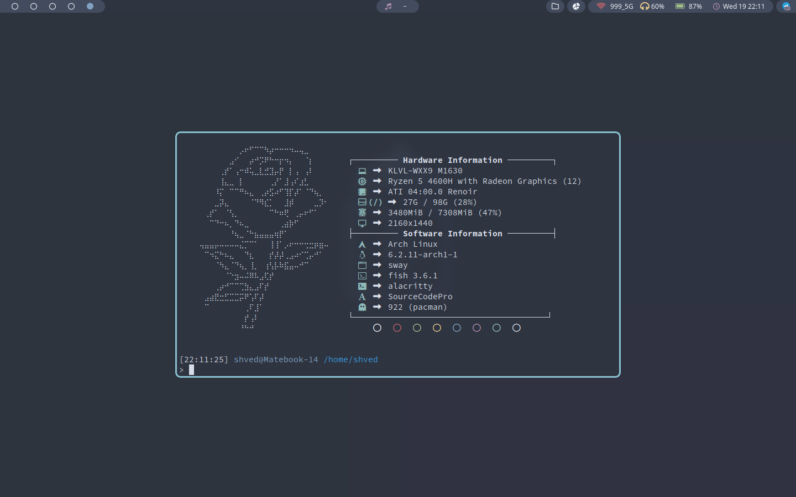
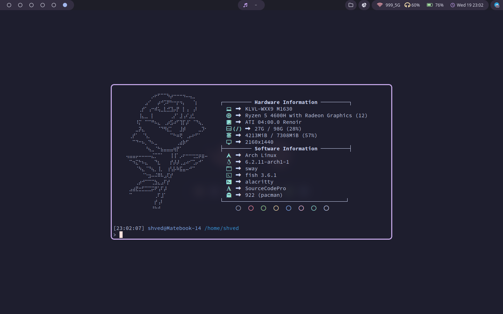

<div align="center">

</div>

<div align="center">
  <p></p>
  <p><b><i> ~ Minimalistic Dotfiles ~ </i></b></p>
  
  
  
  
</div>


|  |  |
| --- | --- |


### ***Table of Contents***

- **[Table of Contents](#table-of-contents)**
    - **[Screenshots](#screenshots)**
    - **[Environment](#environment)**
    - **[Themes](#theme-change-script)**
    - **[Dependencies](#dependencies)**

<!-- ### ***Screenshots*** <details>
<summary><b>Nord</b></summary>

|  |  |
| --- | --- |
|  |  |

</details>

<details>
<summary><b>Rose Pine</b></summary>

|  |  |
| --- | --- |
|  |  |

</details> -->

### ***Environment***

- **Distro**: Mac OS X
- **Compositor**: Quartz
- **Terminal**: iTerm 2
- **File Manager**: Finder
- **Editor**: NeoVim / VSCode / Jetbrains Suite
- **Browser**: Firefox / Brave
- **Shell**: Zsh
- **App Laucher**: Finder
- **Font**: [JetBrainsMonoNFM](https://github.com/ryanoasis/nerd-fonts/releases/download/v3.0.1/JetBrainsMono.zip)

### ***Dependencies***

- make
- stow
- g++
- nvim 0.7.0+
- oh-my-zsh

```
brew install stow
brew install g++
```

Latest version of nvim can be downloaded from its git repo page.

Make sure to install oh-my-zsh from official site.


### ***Installation***
1. Clone this directory to your home directory.

2. Run the makefile command to symbolically link all of the configurations to this repository.

### Example

```
cd ~

cd dotfiles/

make all
```

<div align="center"></div>
